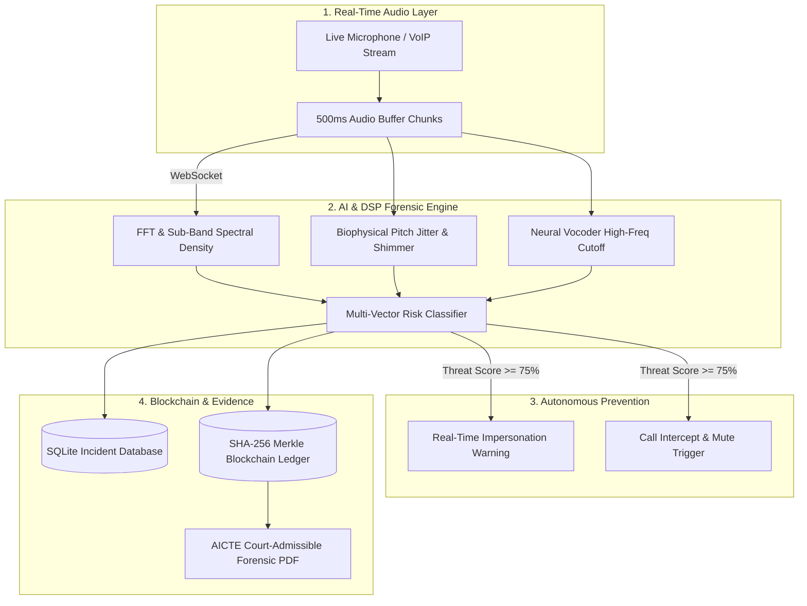

# VoiceShield-AI (SIH26104) 🛡️

**AI-Powered Real-Time Detection and Prevention of Voice Cloning Impersonation Attacks**

* **Problem Statement ID:** SIH26104
* **Organization:** AICTE – Cyber Security Cell
* **Category:** Software
* **Theme:** Blockchain & Cybersecurity

---

## 🌟 Overview

**VoiceShield-AI** is an autonomous, ultra-low latency (<200ms) cyber-defense platform designed to detect and intercept AI-generated voice cloning attacks (such as ElevenLabs, VALL-E, Tortoise, and RVC) in real-time streams and VoIP calls. 

It combines **Acoustic & Biophysical Liveness Inspection** with an **Immutable Blockchain Forensic Ledger**, producing court-admissible digital chain-of-custody evidence for Law Enforcement and the AICTE Cyber Security Cell.

---

## 🏛️ System Architecture



---

## 🔬 Core Innovations & Detection Vectors

### 1. Biophysical Vocal Cord Liveness
Natural human vocal folds possess involuntary micro-perturbations:
- **Natural Pitch Jitter ($J_{local}$):** Typically $0.5\% \le J \le 2.5\%$. Neural synthesis engines mathematically over-smooth speech ($J < 0.25\%$) or produce phase discontinuities ($J > 4.5\%$).
- **Amplitude Shimmer ($S_{local}$):** Natural respiratory modulation ($1.0\% \le S \le 5.0\%$).

### 2. Synthetic Vocoder Cutoff Analysis
Neural vocoders (HiFi-GAN, MelGAN, BigVGAN) operating at standard 16kHz/22kHz sampling rates exhibit distinct spectral roll-offs and high-frequency attenuation above 7.5 kHz.

### 3. Blockchain Proof-of-Custody (SIH Theme Compliance)
- Every detected impersonation attempt generates an immutable block linking the **SHA-256 Audio Hash**, caller ID, acoustic anomaly telemetry, and timestamp.
- Ensures evidence integrity for police FIR filing and court proceedings under the Indian Evidence Act / IT Act.

---

## 🚀 Quick Start Guide

### Prerequisites
- Python 3.10+ installed
- Chrome / Edge browser (for HTML5 Microphone API)

### 1. Run with 1-Click (Windows)
Double-click `start_server.bat` in the project folder.

### 2. Run via Terminal / PowerShell
```powershell
# Navigate to project directory
cd VoiceShield-AI

# Install dependencies (if not already installed)
pip install -r requirements.txt

# Run application server & launcher
python run.py
```

Open your browser at **`http://127.0.0.1:8000`**.

---

## 💻 Tech Stack

| Layer | Technologies |
| :--- | :--- |
| **Backend & DSP** | Python 3, FastAPI, NumPy, SciPy, WebSockets, Uvicorn |
| **Database** | SQLite 3 (ACID-compliant relational store) |
| **Blockchain** | Pure SHA-256 Merkle Chain with Proof-of-Work sealing |
| **Frontend** | Tailwind CSS, Canvas HTML5 Oscilloscope, Chart.js, Vanilla JS |
| **Testing** | Python `unittest` suite (100% green passing) |

---

## 🧪 Automated Testing
To run the automated test suite:
```powershell
python -m unittest discover -s tests
```
